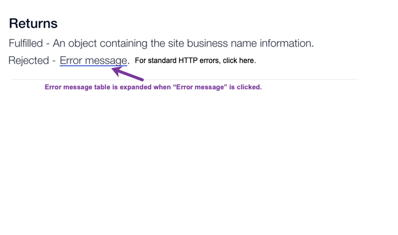

# Error Handling

What can we say, errors happen! Let's discuss how your Velo code can anticipate and handle errors that are returned. 

Errors can come from a number of sources, such as standard HTTP errors, JavaScript errors, and vertical-specific errors issued by the server. 

Some errors that you encounter will be application errors, some errors will be validation errors... 

To help you plan for errors and understand why they happened when they did, the Velo error object provides the relevant details. Once you
see the information provided, you will feel confident that you can develop your code accordingly. 

Build in as much preemptive error handling as possible in your code to give your site visitors as smooth an experience as possible.

## Understanding the Error Object

When an error occurs, Velo returns an object with the following information. 

| Key | Sample Values             | Description                                       |
| ------ | -----------------------  | ---------------------------------------------- |
| code | 4xx, 5xx... | Numbers representing [HTTP status codes](https://developer.mozilla.org/en-US/docs/Web/HTTP/Status), such as 400, 404.... |
| text | Not Found, Forbidden... | Text of the [HTTP status code](https://developer.mozilla.org/en-US/docs/Web/HTTP/Status). |
| message | Cannot create the item because it already exists. | A description that appears in the console describing the error briefly and suggestions for the Velo user to mitigate the issue. |
| severity | error, warning, info...  | Indication of how critical it is that the error be handled in your code. |
| type  | validation, application, system, server, javascript  | The type of error. The type helps you determine how to respond to the issue. For example, validation issues can often be solved by requesting appropriate values, while system errors usually require support.|
| validationIssue | An invalid email address was entered.  | For validation-type errors, more information that can help recover from the error. |
| application | Bookings, Stores, Editor Elements...  | The source of the error. For sites with multiple add-ins, this helps narrow down the source of the error. |
| infoURL| [Velo Reference](https://www.wix.com/velo/reference/api-overview)...  | Links to this Velo Reference or other sources of information that can help you handle the error. |

**Sample JSON Error Object**

    {
      "code": "402",
      “text”: “Payment Required”, 
      "message": “<short text>”,
      “severity”: “error”|“warning”|“info”,
      “type”: “validation”|“application”|“system”|“server”|“javascript”,
      “validationIssue”: “Invalid Email”  \\ If “type” is “validation”,
      “application” : “Bookings”|“Stores”|“Editor Elements”|”General”,
      "infoURL" : <link to docs>
    }

> **Note:** More detailed descriptions for errors are provided in this [Velo Reference](https://www.wix.com/velo/reference/api-overview) under the API functions that return them. The `infoURL` property can contain a direct link to these descriptions.

## Where Will Errors Appear?

Look for errors in the following places.

*    **Velo Developer Console**

     When writing code in Velo, you'll want to preview your site quite often. Previewing runs your code and allows you to check that it's working as expected. In preview, the Developer Console shows at the bottom of the screen. The console displays information that's useful for fixing mistakes in your code, such as errors, logs, and other messages.

*    **Browser Developer Tools**

     Even after your code is published, you can check your site for Velo-issued errors using your browser's development tools, such as [Chrome DevTools](https://developers.google.com/web/tools/chrome-devtools/open) or [FireFox](https://developer.mozilla.org/en-US/docs/Tools). 

*    **Logs**

     *Are there any? Need info.*

*    **Returned Values from Functions**

     *Write this up*

## Catching Errors in Your Code

You can handle errors by adding a `catch()` in your code. The `catch()` receives the error.

One way is to check for errors using `catch()` at the end of a [`then()`](https://support.wix.com/en/article/velo-working-with-promises#error-handling483) chain. 

    import wixData from 'wix-data';
    $w.onReady( function () {
      wixData.query("myCollection")
        .find()
        .then(results => $w("#myTable").rows = results.items)
        .catch(error => {
            // handle your errors here
            switch(expression) {
              case x:
                  // code block
                  break;
              case y:
                  // code block
                  break;
              default:
                  // code block
            }
        } );
    } );

Another way is to use [`try` and `catch()`](https://support.wix.com/en/article/velo-working-with-promises#error-handling) statements. 

    import wixData from 'wix-data';
    $w.onReady( async function () { 
      try {
          const results = await wixData.query("myCollection").find(); 
          $w("#table1").rows = results.items;
      }
      catch(error) {
           // handle the errors here
           switch(expression) {
              case x:
                  // code block
                  break;
              case y:
                  // code block
                  break;
              default:
                  // code block
            }
        }
    });

## Standard HTTP Errors

These error codes are common to all Velo functions. 

| Status Code | Text              | Message                                       |
| ------ | -----------------------  | ---------------------------------------------- |
| 200  | OK                       | Success! |
| 400  | Bad Request              | One or more parameters is incorrect, missing, or did not pass validation for some other reason. |
| 401  | Unauthorized             | The system was not able to authenticate.|
| 403  | Forbidden                | Authenticated succeeded but the correct permissions are lacking. |
| 404  | Not Found                | The entity is not found or does not exist. |
| 409  | Conflict                 | The entity already exists. |
| 429  | Too Many Requests        | Resource usage was exhausted. |
| 500  | Internal Server Error    | A Wix internal error occurred. Try again later. |
| 501  | Not Implemented          | This API is not yet available. |
| 503  | Service Unavailable      | The API/Server is temporarily unavailable. Try again later. |
| 504  | Gateway Timeout          | The API did not respond in a timely manner. Try again later. |

## JavaScript Errors

Your code might return errors native to JavaScript. [Learn more](https://www.w3schools.com/jsref/jsref_obj_error.asp) about handling these types of errors.

## Handling Velo Server (API-specific) Errors

*Not sure what to call these.*

In addition to standard HTTP errors common to all API functions, some APIs might issue additional errors. These errors are described in this  [Velo Reference](https://www.wix.com/velo/reference/api-overview) under each API function's return value.  

